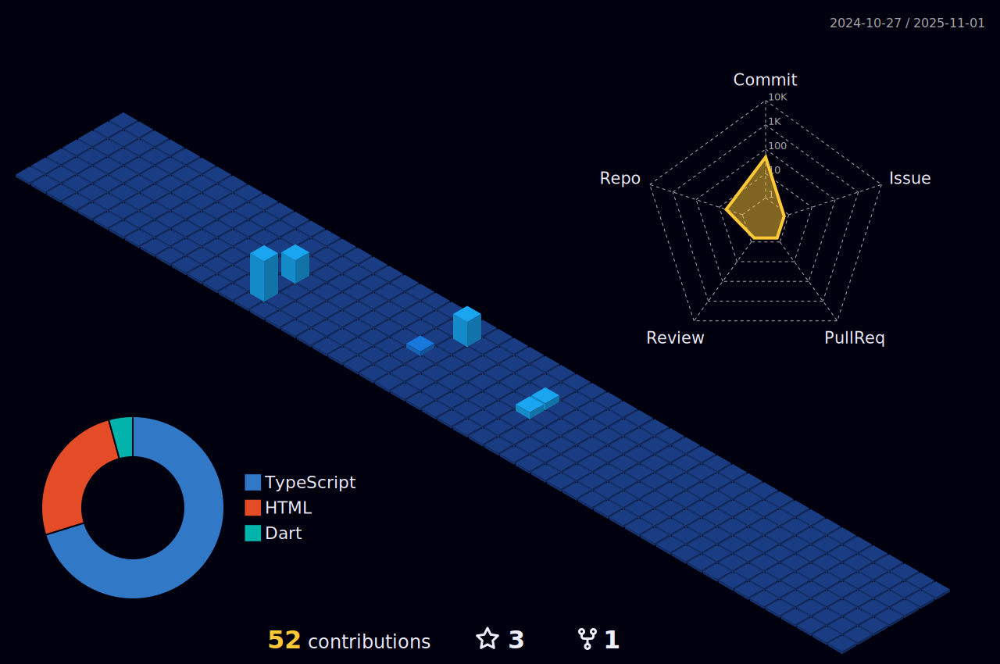

  

 

  

---

  

---

|  |  |  
| ----------- | ----------- |

---

              - name: generate-snake-game-from-github-contribution-grid
                uses: Platane/snk@v3.2.0
            

  

<!-- Optionally include GitHub Streak Stats -->
<!-- 

  

-->

